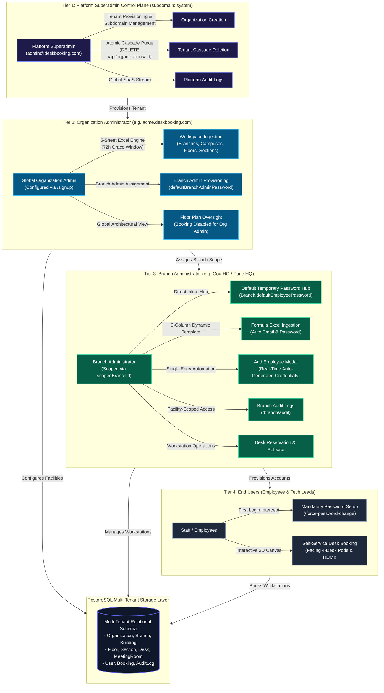

# Multi-Tenant Offline-First Desk Booking & Facility SaaS Control Plane

An enterprise-grade, multi-tenant desk booking, facility administration, and workspace orchestration platform engineered with strict subdomain isolation, a 5-sheet automated Excel ingestion engine with a 72-hour grace modification window, and an interactive 2D architectural floor plan explorer built using Pure React 18, semantic HTML5, and Tailwind CSS.

---

## 🏛️ System Architecture



---

## 💎 Core Feature Modules

### 1. Multi-Tenant Aurora Spectrum Platform Admin Console
* **Unified Superadmin Hub (`system` subdomain):** Dedicated control plane for the Platform Superadmin (`admin@deskbooking.com`) with an iridescent **Multi-Tenant Aurora Spectrum** gradient (`linear-gradient(135deg, #1e1b4b, #312e81, #4338ca, #0284c7, #059669)`).
* **Tenant Lifecycle & Cascade Purge (`DELETE /api/organizations/:id`):**
  * One-click decommissioning of tenant organizations.
  * **Atomic Database Purge:** Executes an atomic transaction that purges child bookings, meeting rooms, workstation desks, floor sections, floors, buildings, branches, employees, and tenant audit logs.
  * **Root System Safeguard:** The root `system` organization is permanently immutable and protected against deletion to prevent platform lockout.
  * **Destruction Warning Modal:** High-visibility confirmation dialog mounted via React Portals with frosted glass backdrops (`backdrop-blur-md`).

---

### 2. Cascading 5-Sheet Excel Ingestion Engine with 72-Hour Grace Window
* **Customized Template Ingestion:** Served directly from `templates/Workspace_FloorPlan_Template.xlsx` with tenant metadata dynamically injected via `JSZip` XML processing.
* **72-Hour Modification Grace Period:**
  * Initial upload records an exact timestamp (`workspaceSetupAt`) and archives the populated workbook (`workspaceSetupExcel`).
  * **Countdown Status Banner:** Real-time countdown on `WorkspaceSetupPage.tsx` showing remaining grace hours.
  * **Re-Downloadable Configuration:** Admins can download their active populated configuration spreadsheet, make corrections, and re-upload within 72 hours.
  * **Permanent Lockdown:** After 72 hours, re-uploads are permanently blocked with `403 Forbidden` and the file upload widget transitions to a locked state.
* **Sheet-Specific Red Error Feedback:** If validation fails, an annotated workbook is generated injecting an **`ERRORS & FIXES`** column **ONLY** into sheets containing errors, detailing row-by-row issues with zero changes committed to the database.

---

### 3. Interactive 2D Floor Plan Explorer (Strict NO-SVG Mandate)
* **Zero-SVG Architecture:** Built exclusively with semantic HTML5 `<div>` containers, CSS Grid, Flexbox, and CSS curvature (`rounded-xl`, `rounded-3xl`)—strictly no `<svg>`, `<canvas>`, or vector graphics.
* **Sanitized Selectors (Zero Database IDs):** Dropdowns for Branch, Building, and Floor display clean human-readable names (`Pune`, `Bhaskar`, `Floor 1`), completely concealing internal database IDs (`BR001`, `BLD001`, `1-FL01`).
* **Ergonomic 4-Desk Pod Clusters:** Workstations are rendered in facing 2x2 clusters with central circulation aisles and service cores.
* **Symmetrical Round-Robin HDMI Distribution:** HDMI badges are distributed diagonally and symmetrically across pods rather than clustered in the first pod.
* **Dynamic Sizing:** Automatic scaling for 3–4 columns ($24–32+$ desks) ensures pods remain contained without boundary overflow.

---

### 4. Role-Based Governance & Desk Booking Scopes
* **Global Organization Administrator (Read-Only Oversight):**
  * Org Admins have overarching architectural oversight across all corporate branches and floors.
  * **Desk Booking Restricted:** The workstation drawer replaces booking buttons with an *Administrative Oversight Mode* badge. Backend endpoints strictly enforce `req.user.role !== 'ORGANIZATION_ADMIN'`.
* **Branch Administrator (Facility Scoped Authority):**
  * Scoped exclusively to their assigned branch (`scopedBranchId`).
  * Floor plan selector is locked to their branch.
  * Can reserve and release workstations within their branch.
* **Employee & Tech Lead (Self-Service Workstation Access):**
  * Standard workstation booking and personal schedule management.

---

### 5. Branch Admin Facility Management & 3-Column Formula Roster
* **Full-Viewport Glassmorphic Modals with React Portals (`createPortal`):**
  * All modals (*Add Employee*, *Edit Employee*, *Status Toggle Confirmation*) are mounted directly onto `document.body`.
  * Frosted glass backdrop aesthetic (`fixed inset-0 z-50 flex items-center justify-center p-4 bg-slate-950/40 backdrop-blur-md`) covers the entire viewport, floating above sticky top headers and sidebars.
* **Direct Inline "Default Temporary Password" Hub:**
  * Added `defaultEmployeePassword` field to the `Branch` model.
  * Direct inline editing input directly beside the Corporate Email Domain input with instant "Configure" saving (no popup modals required). Unconfigured passwords automatically fall back to the organization name in lowercase (e.g. `acmecorporation`).
* **Manual "Add Employee" Formula Automation:**
  * Real-time auto-generation of corporate email as the admin types the employee full name (`mohit.kumar@acme.com`).
  * Clean `Temporary Password` field automatically pre-filled with the branch default password, editable if custom credentials are required.
* **Clean Two-Row Button Hierarchy:**
  * Organized 2-row button cluster: `[Download Ingestion Template]` (top-left) and `[Upload Completed Roster]` (top-right), with `[Export Directory (.xlsx)]` placed cleanly underneath both.
* **Complete Deprecation of Department:**
  * Fully stripped from manual employee entry forms, directory table headers and cells, search filters, templates, exports, and batch parsers.
* **Enterprise Excel `Config` Sheet Redesign:**
  * Formatted in enterprise Navy Blue (`#1F4E79`) with white bold text, Segoe UI typography, custom column widths, and visible gridlines.
  * Auto-populates 5 key metadata parameters: Corporate Domain, Branch ID, Branch Name, Default Password, and Generated Date.
* **Streamlined 3-Column Roster (`Full Name`, `Corporate Email`, `Temporary Password`):**
  * Formulas wrapped in `=IF(ISBLANK(A{r}), "", ...)` ensure unedited rows stay completely blank without displaying orphaned formulas or dangling passwords, preventing batch parser rejections.
  * **Idempotent Upsert Deduplication:** The backend parser uses `prisma.user.upsert` keyed on `(organizationId, email)`, guaranteeing 100% duplicate immunity when re-uploading spreadsheets.
* **Dedicated Branch Admin Audit Logs Console (`/branch/audit`):**
  * Facility-scoped audit log viewer for Branch Admins with live search, action filtering (Staff Enrolled, Status Changed, Password Updated, Batch Imported), and event KPI breakdown cards.

---

### 6. Branch Administrator Lifecycle & Mandatory First-Time Password Reset
* **Mandatory First-Time Password Reset (`mustChangePassword: true`):**
  * Accounts created by the Organization Admin or imported via roster are intercepted upon first login and redirected to [`/force-password-change`](file:///apps/web/src/pages/auth/ForcePasswordChangePage.tsx).
  * Admins and employees cannot access the system until they configure a compliant confidential password (minimum 8 characters).
* **Dynamic Brand Theme Inheritance:**
  * The password setup page dynamically inherits the organization's brand color, styling ambient background glows, logo header, badge pill, input focus rings, password requirement checks, and action buttons.
* **Self-Service Password Recovery:**
  * Includes a dedicated [`/forgot-password`](file:///apps/web/src/pages/auth/ForgotPasswordPage.tsx) page with eye visibility toggles and policy validation.

---

### 7. Global Fault Tolerance (React Error Boundary)
* Built-in `ErrorBoundary` wrapping the layout core protects the application against uncaught rendering errors, displaying a user-friendly recovery card with a "Reload Section" button instead of crashing the browser window.

---

## 🛠️ Technology Stack

| Layer | Technologies |
|---|---|
| **Architecture** | Monorepo (PNPM Workspaces) |
| **Frontend** | React 18, TypeScript, Vite, Tailwind CSS, Lucide React, React Portals, TanStack Query |
| **Backend API** | Node.js, Express, TypeScript, Prisma ORM (v5.22.0), ExcelJS, JSZip, Multer, Bcrypt, JWT |
| **Database** | PostgreSQL (Dockerized or Native Local) |
| **Shared Lib** | `@deskbooking/shared` (Strict TypeScript interfaces, DTOs, and Enums) |

---

## 📂 Monorepo Directory Layout

```
MultiTenant OfflineFirst DeskBooking/
├── apps/
│   ├── api/                     # Express REST API Server
│   │   ├── prisma/
│   │   │   ├── schema.prisma    # PostgreSQL Schema (10 Models, Relations, Indexes)
│   │   │   └── seed.ts          # Idempotent seeding script
│   │   └── src/
│   │       ├── routes/
│   │       │   ├── auth.routes.ts          # Auth, force change, forgot/reset password
│   │       │   ├── organizations.routes.ts # Org CRUD, Atomic Cascade Purge, Branding
│   │       │   ├── roster.routes.ts        # Org-level Branch Admin assignment
│   │       │   ├── branch-roster.routes.ts # Branch Employee Directory, Formulas & Batch Import
│   │       │   ├── audit.routes.ts         # Scoped audit trails (Platform & Branch Admin)
│   │       │   └── workspace.routes.ts     # 5-Sheet Excel setup, 72h grace window, booking
│   │       ├── services/
│   │       │   └── excel.service.ts        # JSZip XML injection, formula templates & error annotators
│   │       └── server.ts
│   └── web/                     # React 18 + Vite Frontend Application
│       └── src/
│           ├── components/
│           │   ├── common/      # ErrorBoundary, Toast notification system
│           │   ├── dashboard/   # PlatformAdminDashboard (Aurora), BranchAdminDashboard
│           │   └── layout/      # Navbar (Aurora / Dynamic Org Theme), Sidebar, AppLayout
│           └── pages/
│               ├── admin/       # WorkspaceSetupPage (72h grace timer), FloorPlansPage, EmployeeRosterPage
│               ├── branch/      # BranchEmployeeRosterPage (3-Col Roster), BranchAuditLogsPage
│               └── auth/        # LoginPage, SignupPage, ForcePasswordChangePage, ForgotPasswordPage
├── packages/
│   └── shared/                  # Shared TypeScript types, DTOs, and enums (@deskbooking/shared)
├── templates/
│   └── Workspace_FloorPlan_Template.xlsx # Master 5-sheet cascading physical layout template
├── schema.svg                   # Vector Architecture & Entity-Relationship Schema Diagram
├── docker-compose.yml           # PostgreSQL database service
├── run.bat                      # 1-click startup script (auto-launches in Google Chrome)
├── README.md                    # Comprehensive platform documentation
└── plan.md                      # Development roadmap (in .gitignore)
```

---

## ⚡ Quick Start Guide

### 1. Prerequisites
* **Node.js**: v18 or v20+
* **PNPM**: Installed globally (`npm i -g pnpm`)
* **Google Chrome**: Recommended browser for automated launch
* **PostgreSQL**: Running natively on port 5432 or via Docker (`docker compose up -d`)

### 2. Launch with One-Click Script
Run the automated Windows batch script from the repository root:
```cmd
.\run.bat
```

The script performs 5 automated stages:
1. `[1/5]` Verifying & starting PostgreSQL on port `5432`.
2. `[2/5]` Verifying and clearing port allocations (Ports `3000` & `4000`).
3. `[3/5]` Installing PNPM workspace dependencies across all monorepo packages.
4. `[4/5]` Generating Prisma client, running database migrations, and seeding credentials.
5. `[5/5]` Starting Backend API (`http://localhost:4000`) and Vite Web Portal (`http://localhost:3000`), automatically launching the portal in a new **Google Chrome** tab as soon as services are ready.

---

## 🔑 Default Credentials & Role Governance Matrix

| Role | Subdomain | Default Email | Initial Temporary Password | Governance Scope |
|---|---|---|---|---|
| **Platform Administrator** | `system` | `admin@deskbooking.com` | `DeskBook$2026#SecureOps!X9` | Global SaaS control plane, tenant provisioning & cascade deletion |
| **Organization Administrator** | Custom (e.g. `acme`) | Configured via `/signup` | User-defined | 5-sheet workspace setup, branch admin assignment, theme branding |
| **Branch Administrator** | Custom | Assigned on Roster page | Organization fallback password (e.g. `Acme Corporation`) | Scoped branch operations, workstation booking, employee directory |
| **Employee** | Custom | Uploaded via Excel | Configured branch default (e.g. `Welcome@Goa2026`) | Self-service workstation booking & profile |

---

## 📊 The 5-Sheet Workspace Ingestion Specification

| Sheet | Purpose | Key Columns | Validation Logic |
|---|---|---|---|
| **1. Organization** | Organization Metadata | `Organization ID`, `Organization Name`, `Number of Branches` | Verified against active tenant session |
| **2. Branches** | Regional Branches | `Branch ID` (`BR001`), `Branch Name`, `Number of Buildings` | Unique branch codes, auto-linked to organization |
| **3. Buildings** | Corporate Campuses | `Branch Name`, `Building ID` (`BLD001`), `Building Name`, `Number of Floors` | Verified against branch counts |
| **4. Floors** | Vertical Floor Levels | `Building ID`, `Floor ID` (`1-FL01`), `Floor Name`, `Number of Sections` | Maximum 4 sections per floor (North, South, East, West) |
| **5. Sections & Cubicles** | Floor Layout & Workstation Specs | `Floor ID`, `Section Direction`, `Number of Cubicles`, `HDMI Cubicles`, `Meeting Room (Yes/No)`, `Meeting Room Capacity`, `Meeting Room HDMI` | Meeting room fields locked if "No"; HDMI count $le$ total cubicles |

---

## 💡 Strategic Recommendations for the Branch Admin Module

To elevate the Branch Administrator module into an industry-leading workplace management experience, here are several high-impact architectural and feature enhancements:

1. **Live Workstation Occupancy & Presence Heatmap:**
   * Overlay real-time booking indicators on the 2D floor plan explorer (e.g., green for available, amber for reserved upcoming, red for currently occupied).
   * Provide a quick metric card showing today's peak facility utilization rate (e.g., *78% Capacity Reached at 11:30 AM*).

2. **Dedicated vs. Hot-Desk Tagging:**
   * Allow Branch Admins to tag specific desks as **"Permanent / Dedicated"** (for fixed personnel such as IT hardware engineers, receptionists, or team managers) versus **"Hot Desk / Flexible"** for agile staff.
   * Dedicated desks can be locked from daily booking rosters or assigned indefinitely.

3. **Maintenance Outage & Section Closure Scheduler:**
   * Enable Branch Admins to schedule temporary maintenance windows for specific sections or entire floors (e.g. AC maintenance, deep cleaning, or carpet replacement).
   * Scheduled closures automatically block desk reservations during the specified window and notify employees holding existing bookings.

4. **Printable Desk QR Codes for Touchless Mobile Check-In:**
   * Generate downloadable, high-resolution QR code badges for each desk (`C-01`, `C-02`).
   * Employees scan the QR code with their mobile device to confirm check-in upon arrival.
   * **Auto-Release Policy:** Desks reserved but not scanned within 30 minutes of reservation start time automatically revert to `AVAILABLE` to prevent phantom ghost reservations.

5. **Shift-Based & Multi-Slot Bookings:**
   * Support granular morning (`09:00 - 13:00`), afternoon (`13:30 - 18:00`), and full-day booking slots to double workstation capacity in hybrid work environments.

6. **Branch Noticeboard & Emergency Broadcast Banner:**
   * Provide a banner creator on the Branch Admin dashboard to post announcements (e.g., *Fire Drill scheduled at 3:00 PM*, *Cafeteria maintenance on Friday*).
   * Displayed exclusively to employees logged in under that specific branch.

7. **Automated Welcome Email Dispatcher (SMTP / SendGrid):**
   * Automatically dispatch welcome emails to employees when imported via Excel batch roster or manually created, including their corporate email, initial temporary password, and a direct link to the `/force-password-change` portal.

---

## 📄 License & Confidentiality
Engineered exclusively for enterprise multi-tenant desk booking and facility management operations. All rights reserved.