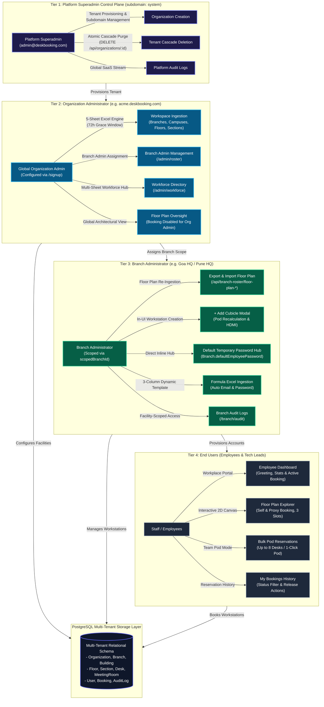

# Multi-Tenant Offline-First Desk Booking & Facility SaaS Control Plane

An enterprise-grade, multi-tenant desk booking, facility administration, and workspace orchestration platform engineered with strict subdomain isolation, a 5-sheet automated Excel ingestion engine with a 72-hour grace modification window, an interactive 2D architectural floor plan explorer built using Pure React 18, semantic HTML5, and Tailwind CSS, and a complete employee workplace portal.

---

## 🏛️ System Architecture



---

## 💎 Core Feature Modules

### 1. Multi-Tenant Aurora Spectrum Platform Admin Console
* **Unified Superadmin Hub (`system` subdomain):** Dedicated control plane for the Platform Superadmin (`admin@deskbooking.com`) with an iridescent **Multi-Tenant Aurora Spectrum** gradient.
* **Tenant Lifecycle & Cascade Purge (`DELETE /api/organizations/:id`):**
  * One-click decommissioning of tenant organizations.
  * **Atomic Database Purge:** Executes an atomic transaction that purges child bookings, meeting rooms, workstation desks, floor sections, floors, buildings, branches, employees, and tenant audit logs.
  * **Root System Safeguard:** The root `system` organization is permanently immutable and protected against deletion to prevent platform lockout.

---

### 2. Global Workforce Directory & Multi-Branch Excel Roster Engine
* **Separation of Concerns:**
  * `/admin/roster` is dedicated strictly to **Branch Admins** with assigned branch badges and credential management.
  * `/admin/workforce` is the dedicated **Workforce Directory** providing cross-branch visibility, department filtering, employee search, and pagination.
* **Dynamic Multi-Sheet Excel Roster Generator (`GET /api/roster/template/multi-branch`):**
  * **Sheet 1 (`Branches & Counts`):** Auto-lists all active organization branches with current employee counts and allocation limits.
  * **Sheets 2..N (Per Branch):** Pre-formatted individual sheets named after each branch (e.g., `Branch_GOA`, `Branch_PUN`) with validation formulas for First Name, Last Name, Department, and Corporate Email.
* **Bulk Multi-Branch Parser & Upsert Service (`POST /api/roster/import/multi-branch`):**
  * Parses multi-sheet workbooks in an atomic transaction.
  * Automatically assigns default branch passwords and validates unique corporate emails.

---

### 3. Branch Admin Floor Plan Spreadsheet Ingestion & In-UI Cubicle Creation
* **Branch-Scoped Floor Plan Export & Re-Ingest:**
  * `GET /api/branch-roster/floor-plan-template`: Generates a branch-specific workbook pre-populated with active buildings, floors, sections, and workstations.
  * `POST /api/branch-roster/floor-plan-import`: Validates and synchronizes workstation additions and modifications directly from spreadsheet uploads.
* **In-UI Manual `+ Add Cubicle` Modal:**
  * Direct workstation creation modal within `FloorPlansPage.tsx`.
  * Options for Standard Cubicle or Meeting Room seat.
  * Real-time pod recalculation (reorganizes desks into 4-desk ergonomic clusters) with dynamic zoom adjustment and symmetrical HDMI redistribution.

---

### 4. Interactive 2D Floor Plan Explorer (Strict NO-SVG Mandate)
* **Zero-SVG Architecture:** Built exclusively with semantic HTML5 `<div>` containers, CSS Grid, Flexbox, and CSS curvature (`rounded-xl`, `rounded-3xl`)—strictly no `<svg>`, `<canvas>`, or vector graphics.
* **Sanitized Selectors:** Dropdowns for Branch, Building, Floor, and Section display human-readable names.
* **Ergonomic 4-Desk Pod Clusters:** Workstations render in facing 2x2 clusters with central circulation aisles.
* **Symmetrical HDMI Distribution:** Displays HDMI badges diagonally across pods rather than clustered in the first pod.
* **Dynamic Zoom Controls:** Smooth scale zoom transforms (70% to 140%) with responsive layout recalculation.

---

### 5. Employee Self-Service Workplace Portal
* **Employee Dashboard (`/` for Role `EMPLOYEE`):**
  * Personalized greeting and facility metrics overview (Total Desks, Available Desks, HDMI Monitors, Meeting Rooms).
  * Active Booking Hero Card with desk code, slot window, location hierarchy, and instant **Release Workstation** action.
  * Quick-launch cards for Workstation Explorer and Reservation History.
* **Interactive Workstation Reservation (`/employee/floor-plan`):**
  * **3 Time Window Slots:** Full Day (09:00 - 18:00), Morning (09:00 - 13:30), Afternoon (13:30 - 18:00).
  * **Date Picker:** Live reservation date selector with instant occupancy recalculation.
  * **Workstation Inspector Drawer:**
    * Book for Myself or Book on Behalf of Colleague (Proxy Booking).
    * Colleague auto-suggest search with live `hasActiveBookingToday` indicator.
    * Atomic double-booking conflict prevention in database transactions.
* **Team Pod Mode (Bulk Multi-Desk Booking):**
  * Quick toggle to select up to 8 workstations simultaneously.
  * One-click **"Select Pod"** action to reserve entire 4-desk pod clusters with a single click.
  * Atomic bulk reservation modal with sprint notes and batch confirmation.
* **My Bookings History (`/employee/my-bookings`):**
  * Tabbed status filtering: `ALL`, `CONFIRMED` (Upcoming/Active), `PAST` (Completed), `CANCELLED`.
  * Search by desk code, branch name, building, section, or notes.
  * Cancellation modal with reason capture and instant status update.

---

### 6. Audit Logs & Security Governance
* Complete audit trail covering:
  * `BOOK_DESK` & `PROXY_BOOK_DESK`: Desk reservation events with slot type and target recipient.
  * `BULK_BOOK_POD`: Multi-workstation team sprint reservations.
  * `CANCEL_BOOKING`: Workstation releases with optional cancellation reasons.
  * `ADD_CUBICLE`: Manual workstation additions by branch administrators.
  * `IMPORT_WORKFORCE_ROSTER`: Multi-branch bulk employee onboarding.

---

## 📦 Project Structure

```
├── apps/
│   ├── api/                     # Express.js + Prisma ORM Backend
│   │   ├── prisma/
│   │   │   └── schema.prisma    # Multi-tenant schema (Org, Branch, Desk, Booking, Audit)
│   │   └── src/
│   │       ├── routes/          # Modular API endpoints
│   │       │   ├── auth.routes.ts
│   │       │   ├── audit.routes.ts
│   │       │   ├── employee.routes.ts
│   │       │   ├── roster.routes.ts
│   │       │   ├── branch-roster.routes.ts
│   │       │   └── workspace.routes.ts
│   │       └── services/        # Excel engines, hashing, auth services
│   └── web/                     # React 18 + Vite + Tailwind CSS Frontend
│       └── src/
│           ├── components/
│           │   ├── dashboard/   # Dashboards by role (Platform, Org, Branch, Employee)
│           │   └── layout/      # Navbar, Sidebar, ProtectedRoute, AppLayout
│           ├── pages/
│           │   ├── admin/       # FloorPlans, Workforce, BranchAdmins, AuditLogs
│           │   ├── branch/      # BranchEmployeeRoster, BranchAuditLogs
│           │   └── employee/    # EmployeeFloorPlanPage, MyBookingsPage
│           └── services/        # Centralized fetchApi client
└── packages/
    └── shared/                  # Shared TypeScript interfaces, Role & Slot enums
```

---

## 🚀 Running the Application

1. **Database Setup:**
   Ensure PostgreSQL is running locally on port `5432` or configure `.env`.

2. **One-Click Startup:**
   ```powershell
   .\run.bat
   ```
   * Verifies port allocations (3000 & 4000).
   * Generates Prisma client and runs database migrations.
   * Starts API on `http://localhost:4000` and Web on `http://localhost:3000`.
   * Automatically launches the web console in the default browser.
