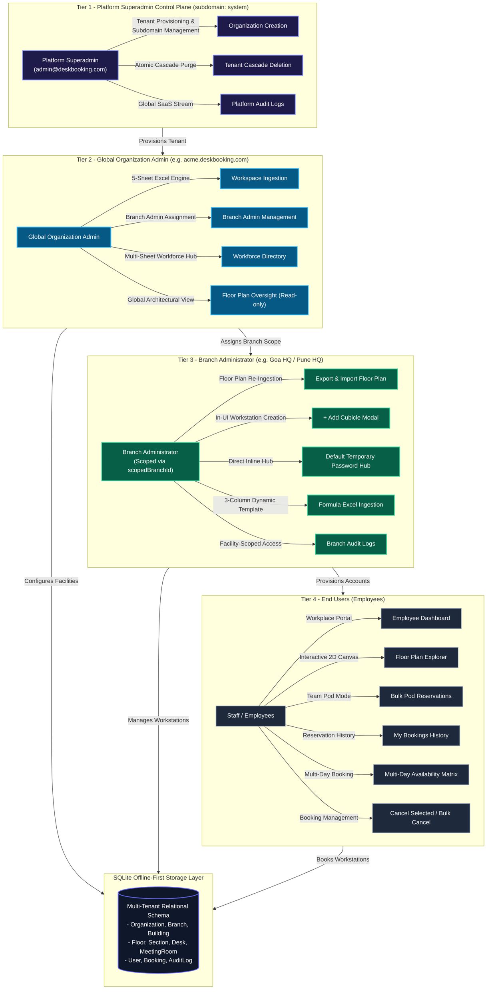

# 🏢 Multi-Tenant Offline-First Desk Booking

> An enterprise-grade, multi-tenant SaaS platform for desk booking, facility administration, and workspace orchestration — engineered with strict subdomain isolation, a 5-sheet automated Excel ingestion engine, an interactive 2D architectural floor plan explorer, and a complete employee self-service workplace portal.


---

## 🏛️ System Architecture



---

## 💎 Core Feature Modules

### 1. 🌐 Multi-Tenant Platform Superadmin Console
- **Unified Superadmin Hub** (`system` subdomain): Aurora Spectrum gradient control plane for `admin@deskbooking.com`.
- **Tenant Lifecycle & Cascade Purge** (`DELETE /api/organizations/:id`): Atomic transaction that purges all child bookings, desks, floors, buildings, branches, employees, and audit logs in one operation.
- **Root System Safeguard**: The `system` organization is permanently immutable — protected against accidental deletion to prevent platform lockout.

---

### 2. 📋 Global Workforce Directory & Multi-Branch Excel Roster Engine
- **Separation of Concerns**: `/admin/roster` manages Branch Admins exclusively; `/admin/workforce` is the cross-branch staff visibility hub with total staff count, search, and pagination.
- **Dynamic Multi-Sheet Excel Generator** (`GET /api/roster/multi-branch-template`):
  - **Sheet 1 (Branches & Counts)**: Auto-lists all active branches with employee counts.
  - **Sheets 2..N (Per Branch)**: Pre-formatted sheets with live email and password column formulas.
- **Bulk Multi-Branch Parser & Upsert** (`POST /api/roster/multi-branch-import`): Atomic transaction parsing across all branch sheets — auto-assigns domain passwords and validates unique corporate emails.
- **Corporate Domain & Password Config**: Configurable per-organization domain and temporary password injected into every branch Excel sheet formula automatically.

---

### 3. 🏗️ Branch Admin Floor Plan Tools & In-UI Cubicle Creation
- **Branch-Scoped Floor Plan Export & Re-Ingest**:
  - `GET /api/branch-roster/floor-plan-template`: Branch-specific workbook pre-populated with buildings, floors, sections, and workstations.
  - `POST /api/branch-roster/floor-plan-import`: Validates and synchronizes workstation data from spreadsheet uploads.
- **In-UI `+ Add Cubicle` Modal**: Direct workstation creation from the Branch Floor Plans UI with real-time pod recalculation, dynamic zoom adjustment, and symmetrical HDMI redistribution.
- **Clickable Conference Pod Seats**: Meeting room seats (M-01 to M-10) are independently bookable from the employee floor plan explorer.

---

### 4. 🗺️ Interactive 2D Floor Plan Explorer (Zero-SVG Architecture)
- **Strict No-SVG Mandate**: Built exclusively with semantic HTML5 `<div>` containers, CSS Grid, Flexbox, and Tailwind CSS border-radius — no `<svg>`, `<canvas>`, or vector graphics.
- **Ergonomic 4-Desk Pod Clusters**: Workstations render in facing 2x2 clusters with central circulation aisles and colour-coded availability states.
- **Symmetrical HDMI Distribution**: HDMI badges distributed diagonally across pods.
- **Dynamic Zoom Controls**: Smooth scale zoom transforms (70% to 140%) with responsive recalculation.
- **Colour-Coded Desk States**:
  - 🟢 **Green** — Available for booking
  - 🔵 **Blue** — Booked by the current user
  - 🔴 **Red** — Booked by someone else

---

### 5. 👨‍💼 Employee Self-Service Workplace Portal
- **Employee Dashboard** (`/` for Role `EMPLOYEE`):
  - Personalized greeting with facility metrics (Total Desks, Available Desks, HDMI Monitors, Meeting Rooms).
  - Active Booking Hero Card with desk code, slot window, location hierarchy, and instant **Release Workstation** action.
- **Workstation Reservation** (`/employee/floor-plan`):
  - **3 Time Window Slots**: Full Day (09:00–18:00), Morning (09:00–13:30), Afternoon (13:30–18:00).
  - **Multi-Day Availability Matrix**: View and select booking dates across a weekly grid.
  - **Workstation Inspector Drawer**: Book for Myself or proxy-book on behalf of a colleague with live `hasActiveBookingToday` indicator.
- **Team Pod Mode (Bulk Multi-Desk Booking)**: Select up to 8 desks simultaneously or reserve entire 4-desk pod clusters in one click with an atomic sprint batch confirmation.
- **My Bookings History** (`/employee/my-bookings`):
  - Tabbed filtering: `ALL`, `CONFIRMED`, `PAST`, `CANCELLED`.
  - **Cancel Selected**: Checkbox-based multi-select for selective cancellation.
  - **Bulk Cancel**: One-click cancellation of all future confirmed bookings.

---

### 6. 📝 Audit Logs & Security Governance

| Audit Event | Description |
|---|---|
| `BOOK_DESK` | Self-booking a workstation with slot type |
| `PROXY_BOOK_DESK` | Proxy reservation on behalf of a colleague |
| `BULK_BOOK_POD` | Multi-workstation team sprint reservation |
| `CANCEL_BOOKING` | Workstation release with optional cancellation reason |
| `ADD_CUBICLE` | Manual workstation addition by a branch admin |
| `IMPORT_WORKFORCE_ROSTER` | Multi-branch bulk employee onboarding event |

---

## 📦 Project Structure

```
MultiTenant-OfflineFirst-DeskBooking/
├── apps/
│   ├── api/                          # Express.js + Prisma ORM Backend
│   │   ├── prisma/
│   │   │   └── schema.prisma         # Multi-tenant schema
│   │   └── src/
│   │       ├── routes/               # Modular API endpoints
│   │       │   ├── auth.routes.ts
│   │       │   ├── audit.routes.ts
│   │       │   ├── employee.routes.ts
│   │       │   ├── roster.routes.ts
│   │       │   ├── branch-roster.routes.ts
│   │       │   └── workspace.routes.ts
│   │       └── services/             # Excel engines, hashing, auth services
│   └── web/                          # React 18 + Vite + Tailwind CSS Frontend
│       └── src/
│           ├── components/
│           │   ├── dashboard/        # Role-specific dashboards
│           │   └── layout/           # Navbar, Sidebar, ProtectedRoute
│           ├── pages/
│           │   ├── admin/            # FloorPlans, Workforce, BranchAdmins, AuditLogs
│           │   ├── branch/           # BranchEmployeeRoster, BranchAuditLogs, FloorPlans
│           │   └── employee/         # EmployeeFloorPlanPage, MyBookingsPage, Dashboard
│           └── services/             # Centralized fetchApi client
└── packages/
    └── shared/                       # Shared TypeScript interfaces, Role & Slot enums
```

---

## 🛠️ Tech Stack

| Layer | Technology |
|---|---|
| **Frontend** | React 18, Vite 5, TypeScript 5, Tailwind CSS 3 |
| **Backend** | Express.js 4, TypeScript, Node.js |
| **ORM & Database** | Prisma ORM, SQLite (offline-first) |
| **Auth** | JWT Bearer tokens, bcrypt password hashing |
| **Excel Engine** | ExcelJS — multi-sheet generation with live column formulas |
| **Monorepo** | pnpm Workspaces |
| **Build Tooling** | Vite (web), ts-node / tsx (API), pnpm |

---

## 🚀 Running the Application

### Prerequisites
- Node.js `>= 18.x`
- pnpm `>= 8.x` (`npm install -g pnpm`)

### One-Click Startup (Windows)
```powershell
.\run.bat
```
The `run.bat` script will:
1. Verify port availability on `3000` and `4000`.
2. Generate the Prisma client and run database migrations automatically.
3. Start the API server on `http://localhost:4000`.
4. Start the web frontend on `http://localhost:3000`.
5. Auto-launch the web console in your default browser.

### Manual Startup
```bash
# Install all dependencies
pnpm install

# Run both API and web concurrently
pnpm dev
```

### Environment Configuration
Copy `.env.example` to `.env` and configure:
```env
DATABASE_URL="file:./dev.db"
JWT_SECRET="your-secret-key"
```

---

## 📋 API Endpoints Overview

| Method | Route | Description |
|---|---|---|
| `POST` | `/api/auth/login` | Authenticate and receive JWT |
| `GET` | `/api/roster/multi-branch-template` | Download multi-branch Excel roster |
| `POST` | `/api/roster/multi-branch-import` | Bulk import employee roster |
| `GET` | `/api/branch-roster/floor-plan-template` | Download branch floor plan workbook |
| `POST` | `/api/branch-roster/floor-plan-import` | Import branch floor plan changes |
| `POST` | `/api/branch-roster/cubicle` | Add a new workstation in-UI |
| `GET` | `/api/employee/dashboard-summary` | Employee dashboard stats |
| `POST` | `/api/employee/bookings` | Create a desk reservation |
| `POST` | `/api/employee/bulk-bookings` | Bulk pod reservation |
| `POST` | `/api/employee/cancel-booking` | Cancel a single booking |
| `POST` | `/api/employee/cancel-selected` | Cancel selected bookings |
| `POST` | `/api/employee/bulk-cancel` | Bulk cancel all future bookings |
| `GET` | `/api/audit` | Fetch organization audit logs |
| `GET` | `/api/health` | API health check |

---

*Built with care — Multi-Tenant Offline-First Desk Booking Platform*
